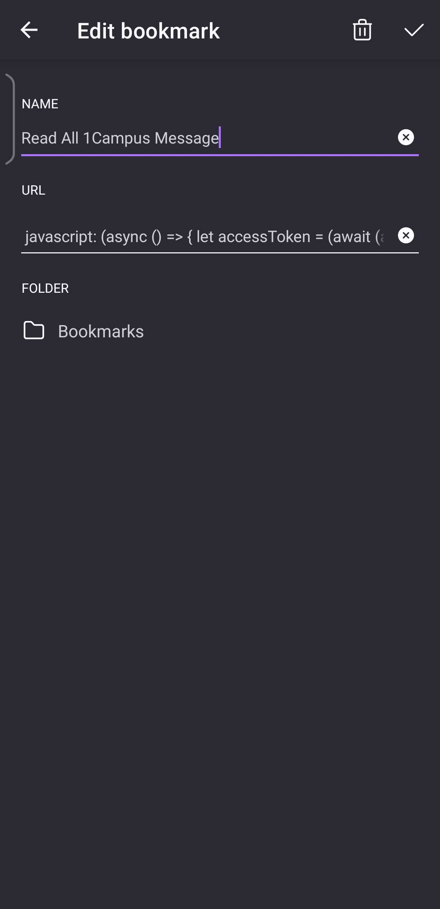

# 1Campus Auto Read
自動已讀所有通知，可能可以在週會時救你一命

複製 [連結](javascript: (async () => { let accessToken = (await (await fetch("https://1campus.net/auth/getAccessToken", { method: "GET" })).json()).access_token; await fetch(`https://1campus-auto-read.netlify.app/.netlify/functions/handle-cors?access_token=${accessToken}`, { method: "GET" }); alert("%E5%B7%B2%E8%AE%80%E6%9C%80%E8%BF%91100%E5%89%87%E8%A8%8A%E6%81%AF%EF%BC%81%E6%84%9F%E8%AC%9D%E4%BD%A0%E4%BD%BF%E7%94%A8 1Campus Auto Read\n%E6%9C%AC%E5%8A%9F%E8%83%BD%E7%94%B1%E5%80%8B%E4%BA%BA%E7%B6%AD%E8%AD%B7%EF%BC%8C%E8%AB%8B%E5%8B%BF%E6%BF%AB%E7%94%A8\n\n%E4%BB%A3%E7%A2%BC%E5%85%AC%E9%96%8B%E6%96%BC https://github.com/NightFeather0615/1campus-auto-read\n\n%E2%80%BB%E6%AD%A4%E6%9B%B8%E7%B1%A4%E5%83%85%E4%BE%9B%E5%AD%B8%E8%A1%93%E7%94%A8%E9%80%94%EF%BC%8C%E4%B8%8D%E8%A8%98%E9%8C%84%E4%BB%BB%E4%BD%95%E5%80%8B%E4%BA%BA%E8%B3%87%E6%96%99"); }) ();) 並新增至瀏覽器書籤，名稱隨意，使用時在 [1Campus 網頁版](https://1campus.net/) 打開書籤即可

